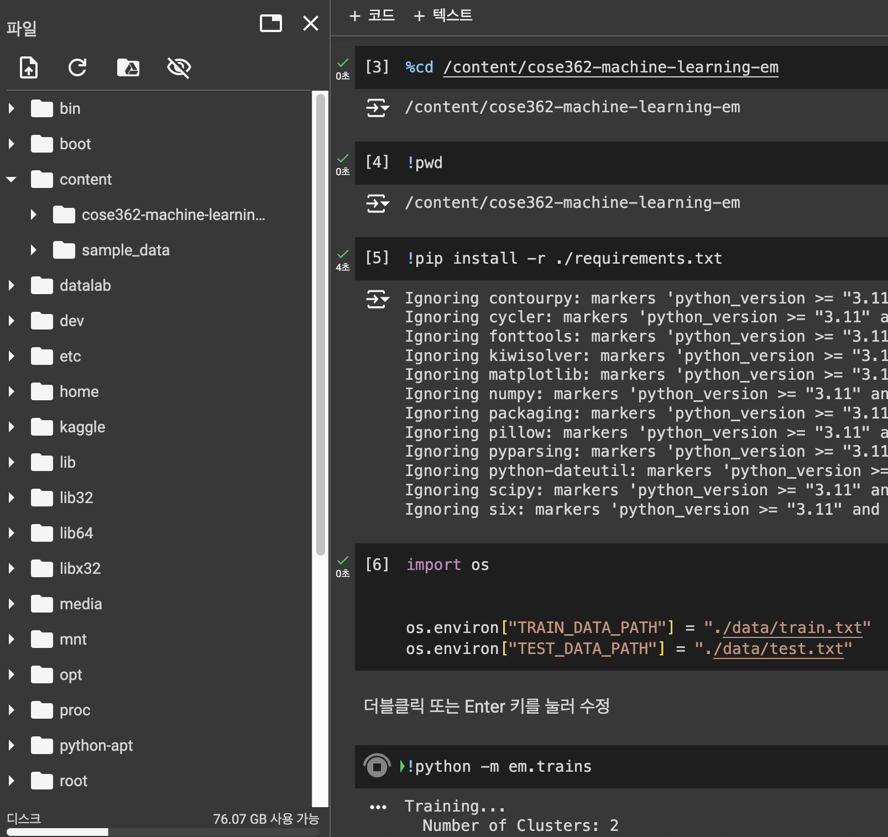

# COSE474 Machine Learning - GMM Classification with EM Algorithm

2020170812 임정섭

## 파일 구조

## 실행 방법

### 1. 환경변수 설정

### 리눅스/MacOS 환경

파이썬 3.11 이상이 설치된 리눅스 환경을 기준으로 설명합니다.

```bash
export TEST_DATA_PATH="./data/test_data.txt"
export TRAIN_DATA_PATH="./data/train_data.txt"
```

#### 2. 파이썬 패키지 설치

Poetry 활용을 권장합니다.

```bash
poetry install  # Poetry가 설치되어 있을 경우
pip install -r requirements.txt  # Poetry가 없을 경우
```

#### 3. 모델 학습 및 테스트

```bash
poetry run python em/trains.py  # Poetry가 설치되어 있을 경우
python train.py  # Poetry가 없을 경우
```

### Colab 환경



## 모델 개요

### 데이터셋

- input x는 D=13차원의 연속형 변수입니다.
- output y는 K=2개의 클래스를 갖는 범주형 변수입니다.
- 데이터셋에는 N=60290개의 sample이 존재합니다.

### Inductive Biases

- iid 가정: 데이터셋의 sample끼리는 서로 독립적이고 동일한 분포를 따릅니다.
  - P(x_1, x_2, ..., x_N) = Π_{n=1}^{N} P(x_n)
- 베이지안 결정: x의 예측 결과는 각 class에 대한 posterior가 최대가 되는 class로 결정됩니다.
  - posterior P(c_k|x) = P(x|c_k) *P(c_k) / Σ_{j=1}^{K} P(x|c_j)* P(c_j)
- likelihood 분포: class k에 대한 likelihood 분포 P(x|c_k)를 Mixtured Gaussian Distribution으로 가정합니다.
  - P(x|c_k) = Σ_{z=1}^{Z} P(x|g_z, c_k, θ_kz) * P(g_z|c_k, θ_z)
  - P(x|g_z, c_k, θ_kz) ~ N(x|μ_kz, Σ_kz)
  - P(g_z|c_k, θ_z) ~ Multinomial(g_z|ϕ_k) => P(g_z|c_k, θ_z) = ϕ_z
  - class별 group의 개수 Z는 같다. (*)
- prior 분포: class k에 대한 prior 분포 P(c_k)를 Multinomial Distribution으로 가정합니다.
  - P(c_k) ~ Multinomial(c_k|π) => P(c_k|θ_k) = π_k
- 추정할 parameters: θ = {μ, Σ, ϕ, π}
  - μ_kz: class k일 때 group z의 D x 1 mean vector (μ: K x Z x D tensor)
  - Σ_kz: class k일 때 group z의 D x D covariance matrix (Σ: K x Z x D x D tensor)
  - ϕ_kz: class k일 때 group z의 prior probability (ϕ: K x Z matrix)
  - π_k: class k의 prior probability (π: K x 1 vector)
- Searching Strategy: EM 알고리즘
  - Loss Function: Minus expectation of log likelihood (-1 * Baum's Q function) = - Q(θ' | θ)

(*) 이 가정은 가설 공간 클래스, 다시 말해 hyperparameter의 개수를 1로 규정합니다. class별 group 수가 다르다면, hyperparameter의 개수가 class 수인 2가 됩니다. 비록 group 수는 이산형이어서 validation error rate를 최소로 가지는 group 수의 조합을 찾기는 어렵지 않으나, 이는 가설 공간 클래스의 원소(가설 공간)의 수를 지수배로 늘립니다. 따라서 학습의 효율성을 위해 group 수는 class별로 동일하게 설정했습니다.

## EM 알고리즘 상세

### 초기화 방법

어떤 class k에 대한 group z의 mean vector μ_kz, covariance matrix Σ_kz, prior probability ϕ_kz를 초기화하는 방법은 다음과 같습니다.

아래 우선순위에 따라 초기화 방법을 선택했습니다.

1. 계산이 빠를 것
2. 전체 데이터셋의 특성을 잘 반영할 것
3. 수렴 속도가 빠를 것

#### μ_kz

class k의 모든 sample들 중에서 무작위로 n개의 sample을 추출하여 평균을 μ_kz로 설정합니다.

기각된 방법:

- 랜덤 벡터 생성: 랜덤 벡터를 생성하면 데이터셋의 특성을 반영하지 못한다. 또한, 랜덤 벡터가 너무 멀리 떨어져 있으면 수렴 속도가 느려질 것이라고 판단했습니다.
- class k의 모든 sample들의 평균을 μ_kz로 설정: 서로 다른 group 간 초기 평균이 완전히 같으므로 최적화 과정에서 데이터를 group으로 정밀하게 분류하지 못할 것이라고 판단했습니다. 또한, 실제 실행시켜보니 그로 인해 공분산 행렬이 singular matrix가 되는 경우가 발생했습니다.
- class k의 모든 sample들 중에서 무작위로 1개의 sample을 선택: 계산이 빠르나, 전체 데이터셋의 특성을 잘 반영하지 못할 것이라고 판단했습니다.

선택하는 n의 값이 커질수록 초기 평균의 분산이 작아지나, 너무 작으면 group 간의 차이를 잘 반영하지 못할 것이라고 생각하여 직관적으로 전체 데이터셋 크기의 약 1/60인 n=1000으로 정했습니다.

#### Σ_kz

class k의 모든 sample에 대한 covariance matrix를 계산하여 Σ_kz로 설정합니다.

근거: sample covariance는 사용하면 전체 데이터셋의 특성을 온전히 반영합니다. target covariance도 group마다 같을 수 있으므로, 초기화 과정에서는 sample covariance를 사용해도 무방하다고 보았습니다.

#### ϕ_kz

uniform distribution을 따른다고 가정하고 1/Z로 설정합니다.

근거: group의 prior probability는 초기화 시점에 큰 직관이 없었으므로 균등하게 두었습니다.

### 종료 조건

prameter의 변화량의 수렴성과 최대 반복횟수를 종료 조건으로 설정했습니다.

#### 1. parameter의 미소 변화량이 수렴

원론적으로, EM 알고리즘은 loss function인 Q(θ' | θ)가 수렴할 때까지 반복해야 합니다. 그러나 Q(θ' | θ)를 계산하는 것은 매우 비용이 많이 들며, Q(θ' | θ)는 현재 parameter θ에 대한 함수이므로 parameter θ의 수렴으로 대신 반복 종료를 판정했습니다. 즉, 모든 parameter(μ, Σ, ϕ)의 각 변화량이 torrence(=10^-6)보다 작아지면 EM 알고리즘을 종료합니다.

#### parameter 별 수렴조건

> 이전 step의 모수는 문자 그대로, 다음 step의 모수는 문자 뒤에 prime(')을 붙였습니다.
> torrerence = 10^-6

- mean: |μ' - μ| < torrence  (||는 L2 norm)
- covariance: |Σ' - Σ| < torrence  (||는 L2 norm)
- group prior: |ϕ' - ϕ| < torrence  (||는 L2 norm, 여기서는 절댓값)

#### 2. 최대 반복횟수 설정

EM 알고리즘의 수렴 속도가 느릴 수 있으므로, 최대 반복횟수를 2000회로 설정했습니다. 참고로, group 수가 4개일 때까지는 대부분의 반복이 2000회 이내에 수렴하는 것을 관찰했습니다.

## 모델 선택

hyperparameter: class 별 group 수 z

k-fold cross validation을 사용하여 group 수(z)마다 validation error rate를 구하고, 그 중 가장 작은 validation error rate를 가지는 group 수를 가설 공간으로 선택했습니다.
fold 수는 5로 설정했습니다. 즉, 학습 데이터셋(train.txt)을 5개로 나누어 구한 5개의 validation error rate의 평균을 group 수별로 구했습니다.


모델 선택 과정에서 정한 class 별 group 수는 4개입니다.

## 성능 평가

train.txt의 전체 데이터셋으로 학습한 모델을 test.txt의 데이터셋에 적용하여 error rate를 측정했습니다.

```
Training is done.
Final Training...
      EM algorithm
      Iterations: 2000
      EM algorithm
      Iterations: 134
Testing...
Test Error Rate: 0.15175770686857762
```
